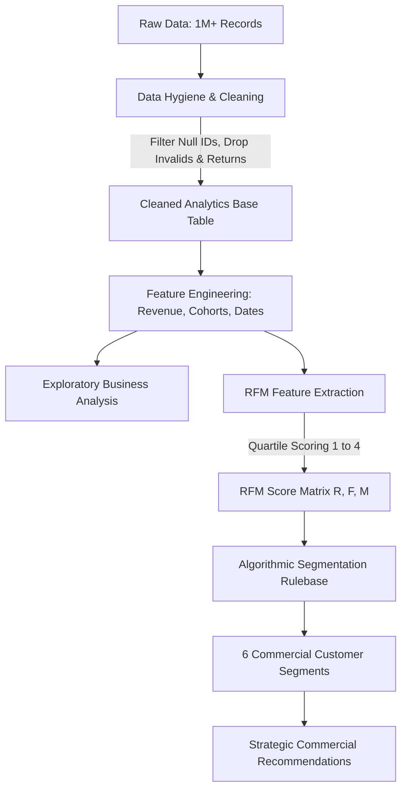

# 📊 Customer Segmentation & Retention Analysis using RFM

[](https://www.python.org/)
[](https://pandas.pydata.org/)
[](https://numpy.org/)
[](https://seaborn.pydata.org/)
[](https://jupyter.org/)
[](https://opensource.org/licenses/MIT)

> **Transforming 1M+ retail transactions into customer intelligence, £17.7M+ revenue attribution, and strategic churn prevention.**

---

## 📌 Table of Contents
- [Executive Summary](#-executive-summary)
- [Business Problem & Objectives](#-business-problem--objectives)
- [Dataset Architecture](#-dataset-architecture)
- [End-to-End Methodology](#-end-to-end-methodology)
- [Exploratory Data Analysis (EDA) Highlights](#-exploratory-data-analysis-eda-highlights)
- [RFM Segmentation Framework](#-rfm-segmentation-framework)
- [Segment Breakdown & Revenue Attribution](#-segment-breakdown--revenue-attribution)
- [Strategic Commercial Recommendations](#-strategic-commercial-recommendations)
- [Repository Structure](#-repository-structure)
- [Getting Started & Reproducibility](#-getting-started--reproducibility)
- [Author & License](#-author--license)

---

## 🏢 Executive Summary

In commercial retail and wholesale businesses, acquiring new customers costs **5x to 25x more** than retaining existing ones. Without clear customer segmentation, marketing campaigns operate blindly—spending resources on churned buyers while neglecting high-value advocates.

This project delivers an end-to-end **Customer Intelligence & RFM (Recency, Frequency, Monetary) Segmentation Pipeline** on the comprehensive **UCI Online Retail II dataset (2009–2011)**. By analyzing over **1 million raw transaction logs** across **5,878 unique customers**, this analysis uncovers:

- **Revenue Power Law**: Top customers (**Champions**, ~31% of user base) account for **£13.46M (~76%)** of total revenue (£17.75M).
- **Critical Churn Risk**: **654 "At Risk" customers** represent **£1.77M** in historically proven purchasing power that is actively slipping away.
- **Geographic Vulnerability**: **83% (£14.4M)** of revenue is concentrated in the United Kingdom, revealing an urgent diversification opportunity across established European markets (EIRE, Netherlands, Germany).

---

## 🎯 Business Problem & Objectives

A UK-based online gifts and homewares wholesaler needed answers to critical commercial questions:
1. **Who are our most valuable customers?** How do we safeguard and incentivize their continued loyalty?
2. **Which accounts are at risk of churning?** How much historical revenue is at stake, and how can we proactively re-engage them?
3. **What seasonal dynamics govern purchasing?** When do order volumes and Average Order Values (AOV) peak, and how should inventory and marketing align?
4. **Where does geographic concentration risk lie?** What international markets display high latent demand for expansion?

---

## 📂 Dataset Architecture

The analysis is conducted on the **Online Retail II UCI Dataset**, containing authentic transactions for a registered UK non-store online retailer between **01/12/2009 and 09/12/2011**.

| Field | Type | Description |
| :--- | :--- | :--- |
| `Invoice` | Categorical / String | 6-digit unique transaction identifier (`C` prefix denotes cancellations) |
| `StockCode` | Categorical / String | 5-digit unique product/item code |
| `Description` | String | Product name/description |
| `Quantity` | Integer | Quantities of each product ordered per transaction |
| `InvoiceDate` | Datetime | Date and time when the transaction was generated |
| `Price` | Float | Unit price of the product (£ GBP) |
| `Customer ID` | Float / Identifier | Unique 5-digit customer identification number |
| `Country` | Categorical / String | Name of the country where the customer resides |

---

## ⚙️ End-to-End Methodology



### 1. Data Hygiene & Cleaning
- **Handling Missing Identifiers**: ~22.76% (243,007 records) lacked `Customer ID` values and were removed to ensure customer-level attribution fidelity.
- **Cancellation & Return Removal**: Transactions with negative quantities (returns down to -80,995 units) and negative unit adjustments were filtered into separate validation sets.
- **Filtering Non-Merchandise Adjustments**: Screened and removed non-product operational codes such as `POSTAGE`, `DOTCOM POSTAGE`, `Manual`, and `Discount`.
- **Feature Engineering**: Derived `Revenue = Quantity * Price` and parsed transactional timestamps into `YearMonth` periods and customer cohort inception dates (`FirstPurchaseDate`).

---

## 📈 Exploratory Data Analysis (EDA) Highlights

### 1. Monthly Revenue & Seasonality Trends
- **Pre-Holiday Surge**: Sales surge drastically every year in **October and peak in November**, driven by B2B wholesale buyers stocking up for the Christmas season.
- **Post-Holiday Dip**: February represents the slowest sales volume month across both years.
- **Data Truncation Note**: December 2011 reflects incomplete collection up to December 9th.

### 2. Average Order Value (AOV) Dynamics
- **January Restocking Effect**: High average order values emerge in January as retailers reorder essential inventory following holiday sell-outs.
- **Summer Consolidation**: Between March and July, order sizes remain conservative before climbing sharply into Q4.

### 3. Geographic Concentration & European Expansion
- **UK Market Dominance**: **£14.4M (83% of total revenue)** originates domestically in the United Kingdom.
- **Market Risk**: High reliance on domestic demand creates vulnerability to localized economic downturns.
- **International Growth Targets**: EIRE (£617K), Netherlands (£554K), and Germany (£425K) demonstrate high conversion readiness for localized marketing expansion.

### 4. Cohort Dynamics (New vs. Returning)
- Over the 2-year analysis window, the proportion of **returning customers steadily increased**, consistently exceeding new customer volume by late 2011.
- **Retention is the primary growth driver**: Sustaining existing customer relationships is markedly more critical to revenue than top-of-funnel customer acquisition.

---

## 🎯 RFM Segmentation Framework

Customers were evaluated along three core behavioral dimensions calculated relative to an operational cutoff date (`max(InvoiceDate) + 1 day`):

$$\text{Recency } (R) = \text{Reference Date} - \text{Latest Transaction Date (days)}$$
$$\text{Frequency } (F) = \text{Unique Invoices per Customer}$$
$$\text{Monetary } (M) = \sum \text{Total Customer Spend (£)}$$

Each customer received a quartile score from **1 to 4** across all three metrics:
- **Recency**: Score 4 (Most recent) to Score 1 (Least recent)
- **Frequency**: Score 1 (Single order) to Score 4 (Highest volume orders)
- **Monetary**: Score 1 (Lowest spend) to Score 4 (Highest total spend)

### Segment Assignment Logic

```python
def assign_segment(row):
    r, f, m = int(row['R_Score']), int(row['F_Score']), int(row['M_Score'])
    if r >= 3 and f >= 3 and m >= 3:
        return 'Champion'
    elif r >= 3 and f >= 2:
        return 'Loyal'
    elif r >= 3 and f <= 2:
        return 'New/Promising'
    elif r == 2 and f >= 3:
        return 'At Risk'
    elif r == 2 and f <= 2:
        return 'Needs Attention'
    else:
        return 'Lost'
```

---

## 📊 Segment Breakdown & Revenue Attribution

| Segment | Customers | % Customers | Total Revenue (£) | % Revenue | Strategic Priority |
| :--- | :---: | :---: | :---: | :---: | :--- |
| 🏆 **Champion** | 1,814 | 30.9% | **£13,463,778** | **75.8%** | **VIP Retention & Advocacy** |
| ⚠️ **At Risk** | 654 | 11.1% | **£1,770,250** | **10.0%** | **Win-Back & Reactivation** |
| 🚪 **Lost** | 1,459 | 24.8% | **£1,051,847** | **5.9%** | **Churn Post-Mortem & Re-engagement** |
| 💎 **Loyal** | 803 | 13.7% | **£792,028** | **4.5%** | **Upselling to Champions** |
| 🔔 **Needs Attention** | 812 | 13.8% | **£543,446** | **3.1%** | **Re-engagement Campaigns** |
| 🌱 **New / Promising** | 336 | 5.7% | **£131,235** | **0.7%** | **Onboarding & Repeat Purchase Nurturing** |
| **Total** | **5,878** | **100%** | **£17,752,584** | **100%** | |

```
Revenue Distribution by Segment (£ Millions)
=============================================================
Champion        [£13.46M]  ████████████████████████████████ 75.8%
At Risk         [£1.77M]   ████ 10.0%
Lost            [£1.05M]   ██ 5.9%
Loyal           [£792K]    █ 4.5%
Needs Attention [£543K]    █ 3.1%
New/Promising   [£131K]    ▏ 0.7%
```

---

## 💡 Strategic Commercial Recommendations

### 1. Protect & Elevate the Champions (£13.46M Asset)
- **Dedicated Account Management**: Provide tier-1 VIP support and assigned account managers for wholesale inquiries.
- **Early-Access Inventory**: Offer advance pre-orders for Q4 Christmas inventory in August/September before stock shortages occur.
- **Tiered Volume Rebates**: Establish rebate structures that incentivize larger single-order bulk fulfillment.

### 2. Rapid Win-Back for "At Risk" Accounts (£1.77M Opportunity)
- **Automated Behavioral Triggers**: Set up automated CRM triggers when a previously high-frequency customer exceeds 90 days without an order.
- **Personalized Re-Engagement Incentives**: Deploy custom re-engagement promotions featuring items from their top historically ordered categories.
- **Customer Feedback Loops**: Conduct outbound outreach to identify if order drop-offs stemmed from logistics, pricing, or product availability issues.

### 3. Monetize the "Loyal" Segment into Champions (£792K Baseline)
- **Product Cross-Selling**: Implement recommendation models highlighting complementary products frequently bought together.
- **Threshold Free-Shipping**: Introduce targeted basket thresholds to increase Average Order Value (AOV).

### 4. Mitigate UK Geographic Concentration Risk
- **Localized European Portals**: Launch targeted distributor marketing in EIRE, Netherlands, and Germany.
- **Fulfillment Optimization**: Evaluate bonded EU warehousing to eliminate post-Brexit cross-border shipping frictions and import delays.

---

## 📁 Repository Structure

```plaintext
Customer-Segmentation-and-Retention-Analysis/
├── customer-segmentation-and-retention-analysis.ipynb   # Complete analysis, pipeline & EDA
├── README.md                                           # Comprehensive project documentation
├── LICENSE                                             # MIT License
```

---

## 🚀 Getting Started & Reproducibility

### Prerequisites
- Python 3.9 or higher
- Jupyter Notebook or JupyterLab

### 1. Clone the Repository
```bash
git clone https://github.com/VeekshaSai27/Customer-Segmentation-and-Retention-Analysis.git
cd Customer-Segmentation-and-Retention-Analysis
```

### 2. Set Up a Virtual Environment
```bash
# Windows
python -m venv venv
venv\Scripts\activate

# macOS / Linux
python3 -m venv venv
source venv/bin/activate
```

### 3. Install Dependencies
```bash
pip install pandas numpy matplotlib seaborn jupyter
```

### 4. Download Dataset
Download the **Online Retail II dataset** from the [UCI Machine Learning Repository](https://archive.ics.uci.edu/dataset/502/online+retail+ii) or Kaggle and place the CSV in your project data directory.

### 5. Launch the Notebook
```bash
jupyter notebook customer-segmentation-and-retention-analysis.ipynb
```

---

## 👤 Author

**Kandula Veeksha Sai Rishita**  
- GitHub: [@VeekshaSai27](https://github.com/VeekshaSai27)  
- Portfolio / Contact: Open an issue or connect on LinkedIn

---

## 📜 License

This project is licensed under the [MIT License](LICENSE) - see the [LICENSE](LICENSE) file for details.
